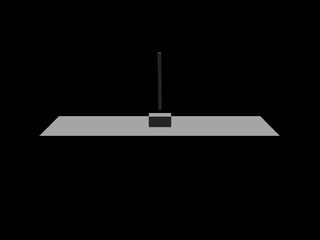

# Weir

<p align="center">
  
</p>

*A weir* — a low dam that directs flow rather than blocking it. The project's earlier
working name was **DAM** (Data · Algorithm · Machine); a weir is the friendlier dam.

Train a simulated legged agent to walk using reinforcement learning. The simulator and the
algorithm are both swappable at the command line — SB3 PPO vs RLtools, MuJoCo vs Isaac Lab —
without touching the training loop.

## Quick demo

About three minutes, no GPU:

```bash
# 1. Train the cartpole balancer (~3 min on CPU)
uv run weir-train agent=cartpole task=balance train.total_steps=100000

# 2. Point at the newest checkpoint
CHECKPOINT=$(ls -t outputs/*/*/checkpoint.zip | head -1)

# 3. Verify: episode length should reach the 500-step horizon
uv run weir-eval --checkpoint "$CHECKPOINT"

# 4. Render it getting pushed around (body 2 is the pole; drop --perturb-* for calm)
uv run weir-render --checkpoint "$CHECKPOINT" --output cartpole.mp4 --frames 250 \
  --perturb-force 8 --perturb-body 2
```

After ~100k steps the policy balances the full episode (`mean_episode_length ≈ 500`),
recovering from pushes up to ~6°.

<p align="center" width="100%">

</p>

## Workflow

Train, evaluate, record, and export:

```bash
# 1. Train the humanoid to walk
uv run weir-train agent=humanoid task=walk_forward

# 2. Evaluate (mean reward, episode length, forward distance)
uv run weir-eval --checkpoint outputs/2026-08-15/<run>/checkpoint.zip

# 3. Record a video
uv run weir-render --checkpoint outputs/2026-08-15/<run>/checkpoint.zip --output walk.mp4

# 4. Export to a standalone .onnx file
uv run weir-export --checkpoint outputs/2026-08-15/<run>/checkpoint.zip
```

Every run writes a manifest (`checkpoint.meta.json`) beside the checkpoint with the resolved
config and shapes; the tools above rebuild the environment from it, so a checkpoint can't be
paired with the wrong model — no flags needed.

## Configuration

Everything lives in YAML under `configs/`. `configs/train.yaml` picks one file per group —
agent, task, sim, algo — and Hydra merges them:

```
configs/
├── train.yaml         # composition + train.seed, train.total_steps
├── agent/             # one robot per file: cartpole.yaml, humanoid.yaml
├── task/              # one objective per file: balance, standing, walk_forward, ...
├── sim/               # one backend per file: mujoco.yaml
└── algo/              # one algorithm per file: ppo.yaml
```

Full reference: [`docs/configuration.md`](docs/configuration.md).

Any value can be overridden on the command line:

```bash
uv run weir-train agent=humanoid task=walk_forward        # swap a group
uv run weir-train task.params.min_height=1.0              # nested value
uv run weir-train train.total_steps=500000                # top-level value
uv run weir-train agent=humanoid task=walk_forward algo.n_steps=4096
```

- Values are typed: numbers, booleans, lists (`[64, 64]`)
- New keys need a `+` prefix: `+task.params.thing=1`
- `algo.checkpoint=<path>` resumes training (weights only)

## Repository layout

```
weir/
├── cli/            # entry points: train, eval, export, render
├── core/           # protocols, tasks, factory, shared utils
├── envs/
│   ├── backends/   # SimBackend implementations (mujoco)
│   ├── wrappers/   # SimBackend decorators (sim-to-real hardening)
│   └── gym_env.py  # gymnasium adapter
└── algo/           # AlgorithmPlugin implementations (ppo)
configs/            # Hydra config groups: agent/, task/, sim/, algo/
```

## Development checks

```bash
uv sync --group dev
uv run ruff check .
uv run ruff format --check .
uv run pyright
uv run pytest
```
